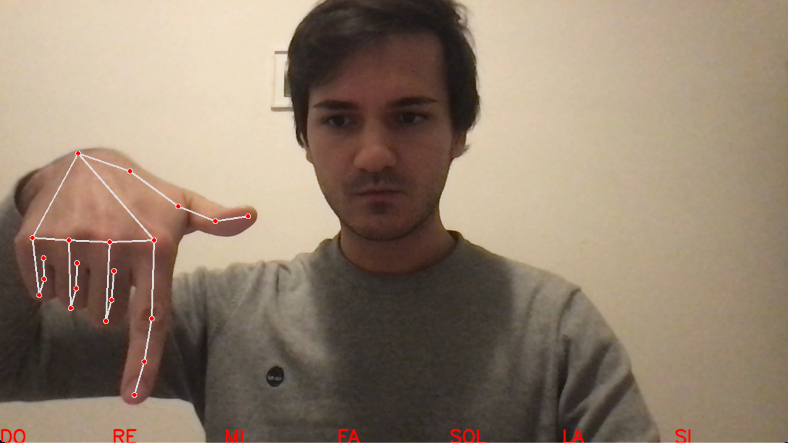
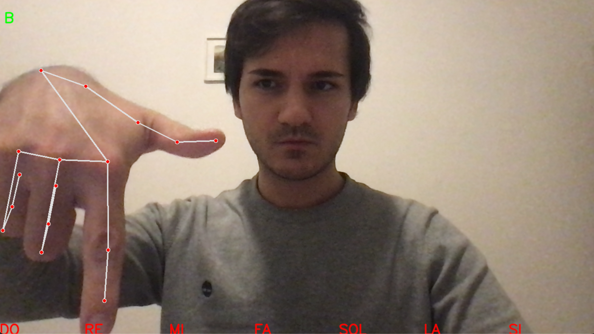

# Piano-Simulator

The purpose of this tool is a Piano playing simulation simply using the index finger in front of a webcam. 
The first version of the tool is rudimentary, as it allows you to reproduce only the 7 main notes, for a duration of 0.5 seconds and on octave n°4.

The idea is to recognize the hand from the sequential frames detected by the webcam through classification and then by regression find the coordinates of the tip of the index finger:
 

So the 7 musical notes are drawn on the bottom of the videocapture frame with notation {DO, RE, MI, FA, SOL, LA, SI} in red and when the tip of the index finger touches one of the 7 segments the tool reproduces the note of the corresponding segment for 0.5 seconds and in the meantime the musical note reproduced in green with notation {A, B, C, D, E, F, G} is printed on the screen at the top left:

 

## Architecture & Dependencies

The architecture of this tool is based on the following:
<ul>
    <li> cv2 library for videocapture init and for frame reading </li>
    <li> Google framework MediaPipe for Hand recognition and Hank Key-Points detection -> <a href="https://google.github.io/mediapipe/solutions/hands.html">documentation here</a> </li>
    <li> musicalbeeps library for notes reproduction -> <a href="https://pypi.org/project/musicalbeeps/">documentation here</a>  </li> 
</ul>

 

N.B. : I applied a GNU license to the tool, so anyone who wants to enrich is welcome, as long as they continue to use the GNU license!
  